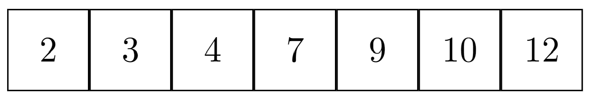
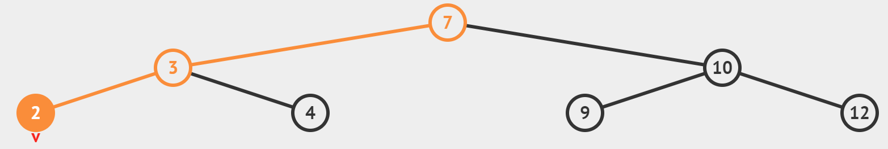

# Experimento ABB

## Desarrollo del algoritmo.
Supongamos un árbol binario de búsqueda con $n$ elementos, sea $h$ la altura del árbol, tal que si $h > log_2(n)$ hagamos un balanceo del árbol.

Para balancear el árbol, vamos a copiar los valores del árbol a un arreglo de tamaño $n$, donde sabemos que $n$ es el número de elementos del árbol, desde aquí podemos ordenar el arreglo, podemos utilizar un algoritmo con complejidad $O(nlog(n)$ (como merge sort) o en el mejor de los casos un algoritmo con complejidad $O(nk)$ (como radix sort), en el caso de utilizar un algoritmo de tipo logarítmico utilizariamos $O(n)$ de espacio, en el caso de utilizar uno lineal, ocuparíamos $O(nk)$.

Ejemplo de arreglo:

Una vez que hagamos esto, podemos hacer un estilo de merge sort/binary search para volver a insertar los datos en el árbol, suponiendo el siguiente arreglo como ejemplo, la raíz sería el 7, partimos el arreglo en dos, excluyendo al 7, ahora insertariamos el 3 y el 10, si volvemos a dividir el arreglo, pero ahora en 4, excluyendo al 3 y al 10, nos quedarían 4 subarreglos individuales, por lo que podemos insertar todo sin problema, el árbol final nos quedaría como lo siguiente:

## Métricas de eficiencia.
Tendríamos que añadir al código un método `checaAltura()`, y tendríamos que añadir esto al método de `inserta`, en dado caso de que `checaAltura()` encuentre un problema lo mandaríamos a un método `balanceaArbol()`, que haría lo que ya describí en el anterior apartado.

El método `checaAltura` aprovecha las características del árbol binario, por lo que su complejidad sería $O(h)$ donde $h$ es la altura del árbol binario, que en el peor de los casos es $n$.

El método `balanceaArbol` primero tiene que sacar todos los datos del árbol binario y meterlos a un arreglo, recorrer un árbol binario nos cuesta $O(n)$, y el arreglo va a utilizar también $O(n)$ en espacio. 

También utiliza un algoritmo de ordenamiento, por lo que tiene al menos $O(nlog(n))$ y como mínimo $O(nk)$ de complejidad para este.

Luego, ya que podemos volver a inicializar el árbol, no hay necesidad de borrarlo, por lo que podemos ahorrarnos las operaciones de borrado, pero aún así tenemos que hacer inserción, cada inserción nos cuesta $O(h)$, por lo que tendremos $O(nh)$ para $n$ inserciones, con $h$ siendo la altura del árbol, como al arreglo de donde vamos a tomar los datos vamos a acceder directamente, tenemos tiempo constante $O(1)$.

Al final de todo esto, tenemos que el tiempo promedio de todo esto sería: $O(h) + O(nlog(n)) + O(nh)$ para todas las operaciones, y solamente se haría cada que $h$ sea mayor que $log_2(n)$.

## Código.
```java
    private void checkBalance(){
        //checamos si la altura se volvio mayor a log(n)
        if(height() > (Math.log(count)/Math.log(2)))
            balanceTree();
    }
    
    private void balanceTree(){
        Iterator<T> itAux = preOrderIterator();
        ordenamiento ordena = new ordenamiento();
        T arr[] = (T[]) new Object[count];
        int i = 0;
        
        //vaciamos el arbol en un arreglo y lo ordenamos
        while(itAux.hasNext()){
            arr[i] = itAux.next();
        }
        ordena.mergeSort(arr,0,arr.length-1);
        
        //borramos el arbol, haciendo que root sea null y no apunte a nada y
        //reiniciando el contador
        root.setElement(null);
        root.setRight(null);
        root.setLeft(null);
        count = 0;
        
        //volvemos a llenar el arbol, añadiendo de manera binaria exponencial
        int n = arr.length;
        if(arr.length%2 != 0)
            n++;
        int tam = n;
        int numerador = 2;
        add(arr[n/2]);
        while(numerador < arr.length){
            n = n/numerador;
            
            for(int j = 1; j < numerador; j++){
                if(j*n-1 != tam/2)
                    add(arr[j*n-1]);
            }
            n = tam;
            numerador *= 2;
        }
        for(int k = 0; k < arr.length; k+=2){
            if(k != tam/2)
                add(arr[k]);
        }
        
        //si el arreglo no puede ser partido de manera binaria perfectamente,
        //al final nos quedaran datos sobrantes que no alcanzan a hacer un nivel
        //entero, para resolver recorro el arreglo con checando con contains()
        //si el dato se encuentra o no, si no se encuentra lo añado
        for(T aux: arr)
            if(!contains(aux))
                add(aux);
    }
```